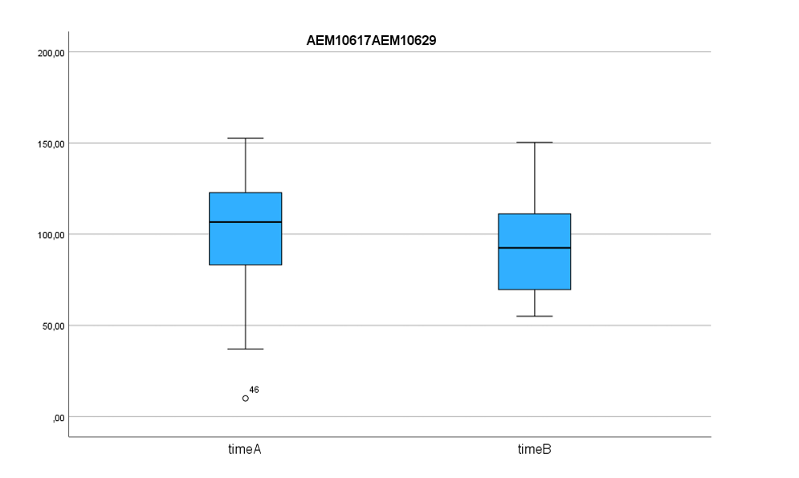
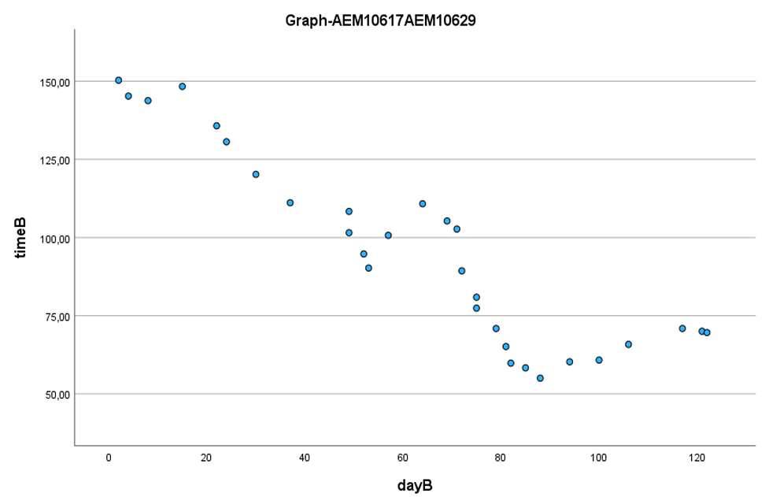

# Statistical Data Analysis: Solving Time Performance & Learning Curves

This repository contains the final project for the **Probability Theory and Statistics** course (June 2023). The project focuses on statistical inference and predictive modeling using **IBM SPSS**, analyzing the performance and learning patterns of players in a word-puzzle game.

## 🚀 Project Overview
The study analyzes two datasets: `timeA` (Player A, experienced) and `timeB` (Student, new player). The goal is to compare performance metrics and model the "learning effect" over time through linear regression.

## 🛠 Methodology & Tools
* **Software:** IBM SPSS Statistics
* **Statistical Techniques:** Descriptive Analysis, Hypothesis Testing (t-tests), Confidence Intervals (95%), Linear Regression, and Correlation Analysis.

## 📊 Statistical Highlights & Results

### 1. Comparative Analysis
* **Performance:** Hypothesis testing confirmed that **Player B (Student)** consistently achieved lower solving times compared to Player A.
* **Variability:** 95% Confidence Intervals for standard deviation showed slightly higher dispersion for Player A ([26.71, 39.94]) than Player B ([19.51, 32.93]).
* **Visual Comparison:**

*Figure 1: Comparison of solving times (timeA vs timeB).*

### 2. Regression & Learning Curves
* **Correlation:** Strong negative correlation found for both subjects (Player A: $r = -0.781$, Player B: $r = -0.820$), proving a significant learning effect.
* **Estimated Models:** * Player A: $time = 145.318 - 0.622 \times day$
  * Player B: $time = 94.609 - 0.618 \times day$
* **Prediction:** The models successfully predict the reduction in solving time as experience increases.
* **Learning Trend:**

*Figure 2: Linear regression model visualizing the learning curve.*

## 📋 Key Findings
* **Learning Rate:** Both players demonstrated nearly identical learning rates (slopes of -0.622 vs -0.618).
* **Stability:** Player B's learning rate remained stable throughout the study, while Player A showed accelerated improvement in the later stages.
* **Limitations:** The report includes a critical evaluation of model assumptions (normality and variance equality).

## 📂 Repository Structure
* `/docs`: Project guidelines and the final analytical report.
* `/images`: Key charts extracted from SPSS (Boxplots, Scatter Plots, Coefficients).

## 📂 Project Documents
* [📄 Assignment Description (PDF)](./docs/Probability_Statistics_Assignment.pdf)
* [✅ Final Project Report (PDF)](./docs/Statistical_Analysis_Report.pdf)

## 🎓 Academic Info
* **Institution:** Aristotle University of Thessaloniki (AUTh)
* **Team:** A. Alexiadis (10617) & A. Galazoulas (10629)
* **Instructor:** Prof. D. Kugiumtzis
